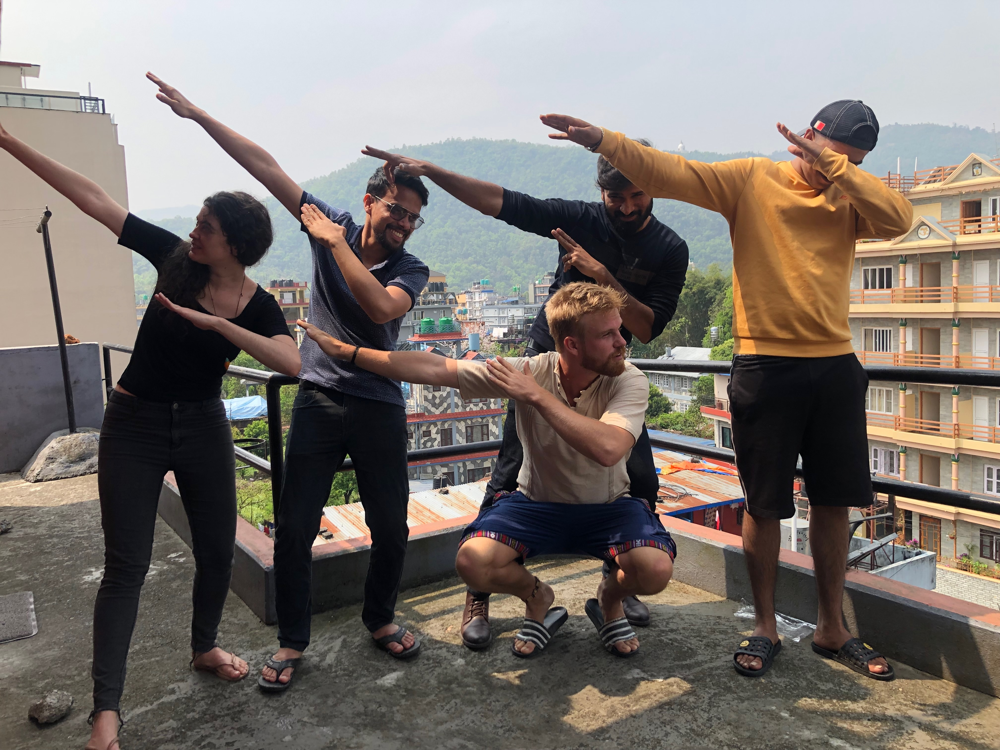

# Code From Anywhere Course

> This course is a work in progress.. Sorry for any unfinished pages, I'm working very hard to complete this a.s.a.p.

Hi! In this course you will learn how to make **full-stack apps** using **Typescript**. This course focusses on the stuff you **REALLY** need to know. We don't go super deep and tell you all the details, we just help you to go from beginner to wizard in under a month, so you can start building full-stack applications and make money with your side-projects!

The course contains 5 sections

- **Beginner**: All the basics you need to know before you can "ship" something
- **Frontend**: The basics to quickly ramp you up to being a frontend developer
- **Full Stack**: The basics to quickly ramp you up to being a full-stack developer that can make both mobile apps and websites!
- **Wizard** The ultimate goal of this course is showing you the real magic that we'll explain in this section. Will you be the next Wizard?
- **Lifestyle** Here we'll talk about what you can do with all of this info you can learn here. Among other things, we'll talk about finance, freedom, entrepeneurship, and becoming a wizard.

Once you're done with this course, you'll be able to make apps (simple versions of things like Facebook, GitHub, Uber, Medium, or whatever) in a matter of weeks. If you are able to achieve wizardry this could even be days.

## A word from me...

<iframe width="100%" height="315" src="https://www.youtube.com/embed/D13goXBeMIc" title="YouTube video player" frameborder="0" allow="accelerometer; autoplay; clipboard-write; encrypted-media; gyroscope; picture-in-picture" allowfullscreen></iframe>

## Still free

This course is completely free for now but it will not be long before I implement my monetisation strategy! So you better take the chance now that it's still possible.

## Community

Please click [here](https://join.slack.com/t/codefromanywhere/shared_invite/zt-18r6mfudt-Zhb7FaZ70WlWVI1a_ZxgPw) to join our community on Slack!

**What do we offer?**

- A great environment to learn to make full stack apps
- Potential to grow using open source and work with our clients
- A great group of people that love coding and freedom to do it from anywhere!

## Bootcamp

Do you really want to kickstart your developer career? I'm accepting applications into our bootcamp. Once we have at least 10 applications, it will get started. This boot camp teaches you this course and guides you through making your first full stack app. We'll have video meetings twice a day, you'll get a study buddy, and you'll join a group of 5-10 people doing this bootcamp, so you can keep each other motivated.

Please note that a [regular bootcamp](https://www.switchup.org/rankings/best-coding-bootcamps) like [LeWagon](https://lewagon.com) easily takes **3 months** and costs **tens of thousands of euros**... Our bootcamp can be done in under **a month** of full-time or 2-3 months part-time, and is **completely free** (for now). Is it just as good as the other bootcamps? We don't know yet, but we're aiming for better.

## What's Code From Anywhere?

We're a software development agency with developers from all over the world. We decided to build a course to share the way we work and make full-stack apps super quickly.

About us

**Who we are**

- Highly motivated developers at your fingertips
- A network of App Developers living the dream.
- We chase freedom to be more motivated, creative and talented than any other agency.
- Young, Ambitious, Adventurous Developers Chasing Freedom
- We build apps and chase freedom by traveling the world
- We attend many conferences and go on adventures so we can enjoy our job and stay on top of our game.

**Our Philosophy**

- **Developer-first**: focus on developer expertise, developer growth, developer freedom, developer lifestyle, developer happiness.
- **Typescript-first**: We mainly use Typescript, React with Native, Expo, Next.js and Node.js (this is the [Sensible Stack](https://sensiblestack.com))
- **Trust-first**: Don’t spend much time on contracts and requirements. Just get going and see where it goes.
- **Remote-first**: There is no requirement of location, never.
- **Humane-first**: We’re only involved in products that are good for humanity and the planet.

Do you have money? If you want to work with us, check [our services](/services)

Do you need money:? If you want to work with us, check [becoming a wizard](/wizard/become-a-wizard)

