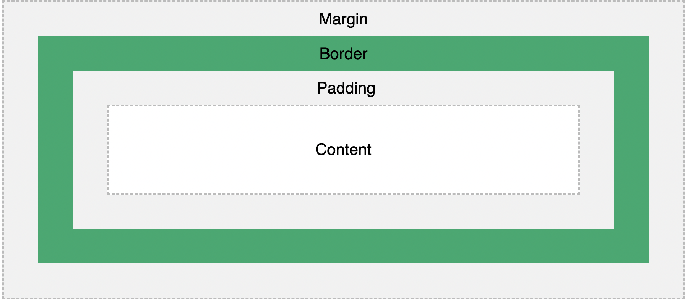

# CSS

## Introduction

CSS stands for Cascading StyleSheet. Although it's quite a relic, it's good to know how it works. Later we'll learn tailwind, but since tailwind compiles to raw CSS, and since not everything is possible with Tailwind as of yet, it'd be good to know the basics.

## Syntax

CSS syntax is simple. You have a key and a value. For example `background-color: yellow` or `font-size: 32pt`.
You can declare css in any html tag inside of the `style` attribute, but you can also create CSS files in which you define styles that apply on classes or whole tags. In this course we will only use the former. We won't use CSS files because later, we'll be moving to Tailwind, and CSS files become rarely neccessary. If you want to know how selectors with CSS files work, have a look [here](https://www.w3schools.com/css/) for a more in-depth tutorial.

So, to summarize, to apply a styles to any html tag, all you need to do is this:

```html
<tag style="property: value; property2: value2; ..."></tag>
```

For example, let's make a paragraph bold with a red color:

```html
<p style="font-weight: bold; color: red;">
  This is a bold paragraph with a red color
</p>
```

We're keeping it simple here, because we're moving away from CSS later in this course. Once we start using React, we'll also start using [Tailwind](https://tailwindcss.com)

## Cheat Sheet

The following is a list of the most common styles that you'll need frequently.

### Colors

Use a hex, rgba, hsl or colorname as a value ([more info](https://www.w3schools.com/html/html_colors.asp)).
Some examples: `green`, `lightblue`, `#FF0000` or `rgba(0,0,0,1)`

- background-color
- color

### Text styles

- text-align
- font-family: Font Name
- font-weight: `bold`
- text-decoration: `underline`
- font-size: Size (see below)

### Box model

Basically, every html element has a box model. That means a couple of css properties can be applied to add some space and other things. This is the box model:



These are the properties:

- border
- margin
- padding
- height
- width

Use a numeric value (optionally add unit to it, see [units](https://developer.mozilla.org/en-US/docs/Web/CSS/length) or a percentage, e.g. `50%` to indicate the size, or use `inherit` for inheriting from the parent.

The border also has a style and color, and can be applied like this `border: {size} {style} {color}`. Style can be `solid` or `dotted` for example, and color can be any color like you've seen above.

### Flexbox model

The flexbox model lets you easily position html elements differently. To use this, you need to play around with the following properties:

- display: `flex`
- flex-direction: `column` or `row`
- justify-content: FlexPosition value ([details](https://developer.mozilla.org/en-US/docs/Web/CSS/justify-content))
- align-tems: FlexPosition value ([details](https://developer.mozilla.org/en-US/docs/Web/CSS/align-items))
- flex-wrap: `wrap`

You can probably guess what they do, but it's best to just play around with them.

### Visibility

- position: `static`, `relative`, `fixed`, `absolute` or `sticky` ([details](https://www.w3schools.com/css/css_positioning.asp))
- z-index: `number`
- overflow: `scroll`, `hidden`, `auto`, `clip` or `visible` ([details](https://www.w3schools.com/cssref/pr_pos_overflow.asp))
- opacity: `number` (between 0 and 1)

## Rounding up

These are the most important CSS properties. It's probably best to keep this list nearby. Print it out and read it over many times and whenever you forgot a property.

There are also many extensions for VSCode to make it easier to use CSS. Have a look in their extensions and search for CSS! Among other things, autocompletion can be very helpful, especially when learning!

Don't spend too much time trying to learn every CSS detail. Quite soon we're going to start using [Tailwind](https://tailwindcss.com), which is much more user-friendly.
